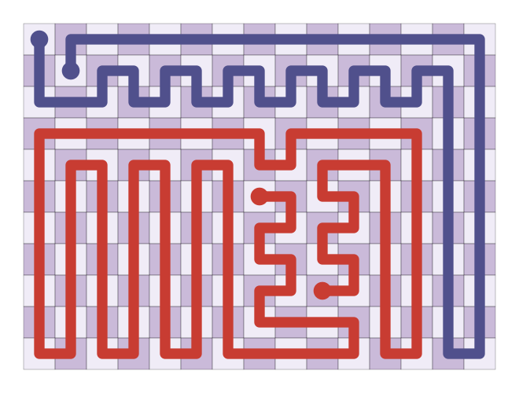

# Two-colour Zig-Zag Numberlink on rectangles

| |
|---|
|  |

Decide and solve two-colour Zig-Zag Numberlink (the paired 2-disjoint path cover problem) on
rectangular grids: given an R × C grid and endpoints s0, t0 (colour 0) and s1, t1 (colour 1), find
two vertex-disjoint paths s0 → t0 and s1 → t1 that together visit every cell, or show that none
exists.

For both sides at least 11, an instance is solvable if and only if none of a finite catalogue of
forbidden patterns occurs; for a side at most 10, a plug dynamic programming algorithm decides it.
Solutions are constructed in polynomial time, and both directions of the characterization are
verified in Lean 4.

| Path | Contents |
|---|---|
| [`paper/`](paper/) | The paper (LaTeX; `make` builds `build/zzn.pdf`) |
| [`docs/`](docs/) | The proof in prose ([`PROOF.md`](docs/PROOF.md)), the algorithm ([`ALGORITHM.md`](docs/ALGORITHM.md)) and the plug DP ([`PLUGDP.md`](docs/PLUGDP.md)), with figures |
| [`lib/`](lib/) | Libraries and command-line programs in Python, JavaScript and C |
| [`lean/`](lean/) | The Lean 4 verification (main results in [`lean/README.md`](lean/README.md)) |
| [`LICENSE`](LICENSE) | CC0 1.0 Universal |

## Quick start

```bash
python3 lib/python/zzn_cli.py 12 12 0 0 0 11 11 0 11 11 --grid
```

The arguments are R, C and the endpoints s0, t0, s1, t1 as row-column pairs. The JavaScript
(`node lib/js/cli.js ...`) and C (`make -C lib/c && lib/c/zzn ...`) programs take the same
arguments and print the same output; see [`lib/README.md`](lib/README.md).

## How to verify

The results rest on the Lean development in [`lean/`](lean/). To check them:

1. **Install Lean** with [elan](https://github.com/leanprover/elan). The toolchain is pinned in
   `lean/lean-toolchain` (Lean v4.35.0-rc2) and Mathlib in `lean/lake-manifest.json`.
2. **Build** the proofs, from `lean/`:

   ```bash
   LEAN_NUM_THREADS=4 lake build ZZN ZZN.Main ZZN.Thin.Decide
   ```

   Running `lake exe cache get` first may download a prebuilt Mathlib and save building it from
   source. The build includes the 144 box checks and 10 window certificates evaluated by
   `native_decide`: about 4 hours on 4 threads (about 17 CPU-hours). We built with 4 threads under
   a 24 GB memory cap. It finishes with no errors and no warnings.
3. **Check the axioms**, from `lean/`:

   ```bash
   lake env lean CheckAxioms.lean
   ```

   Expected: `ZZN.Thin.thinBF_iff` depends only on `propext`, `Classical.choice` and
   `Quot.sound`; `ZZN.passes_iff_solvable` and `ZZN.solvableB_iff` depend on those three plus 154
   axioms named `..._native.native_decide.ax_1_1`, one per box check or window certificate. No
   `sorryAx` appears.
4. **Read the statement.** `lean/ZZN/Defs.lean` (about 60 lines) defines instances, paths and
   solutions, using `InBounds`, `Adjacent` and `chainAdjacent` from `lean/GridHam/Basic.lean`.
   The main theorems are `passes_iff_solvable` (`lean/ZZN/Main.lean`), `solvableB_iff`
   (`lean/ZZN/Thin/Decide.lean`) and `thinBF_iff` (`lean/ZZN/Thin/Fast.lean`). Everything else is
   checked by Lean against these definitions, so these are the parts a reader has to trust,
   together with Lean, Mathlib's axioms and, for the 154 `native_decide` axioms, the Lean compiler.

The `native_decide` axioms trust compiled code instead of the kernel; the paper (Section 9)
explains why, and what checking them in the kernel would cost.

## AI disclosure

Nearly the entirety of the work for this project was done by Claude (Opus 5.5), including writing
the paper, the reference implementations and the Lean 4 proof. The author contributed little more
than the problem statement and guidance.

## License

To the extent possible under law, the author has waived all copyright and related or neighboring
rights to this work: the paper, the source code, the Lean proofs, the documentation and the data.
This work is published under the [CC0 1.0 Universal](https://creativecommons.org/publicdomain/zero/1.0/)
public domain dedication; see [`LICENSE`](LICENSE). Source files carry the SPDX identifier
`CC0-1.0`.
