# Two-colour Zig-Zag Numberlink on rectangles: the algorithm

A reference for the decision and construction algorithm: enough to understand it and to
re-implement it. The dynamic program for thin rectangles has its own page, [PLUGDP.md](PLUGDP.md).
Implementations: [`lib/`](../lib/) (Python, JavaScript, C). Proofs: [`lean/`](../lean/) (Lean 4) and
[`PROOF.md`](../docs/PROOF.md).

## 1. The problem

An **instance** is an R × C grid of cells (r, c), 0 ≤ r < R, 0 ≤ c < C, with four distinct
**endpoints**: s0, t0 of colour **A** and s1, t1 of colour **B**. A **solution** is two
vertex-disjoint paths, s0 → t0 and s1 → t1, moving between edge-adjacent cells, that together visit
every cell. (Zig-Zag Numberlink with k = 2 pairs; NP-complete for unbounded k, Adcock et al. 2015.)

| 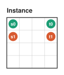 | 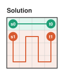 |
|---|---|

**Result.** Solvability is decided in polynomial time, and a solution is constructed when one
exists:
- **thin** instances (a side ≤ 10) are decided and solved by a dynamic program (the **plug DP**);
- otherwise (both sides ≥ 11), an instance is solvable **if and only if** no entry of a finite
  **catalogue** of forbidden patterns fires (§3). Solutions are built by reductions and moves (§4–§6).

Both facts are proved in Lean (§9).

## 2. Terms

- **Thin:** short side ≤ 10. **The domain 𝔇:** both sides ≥ 11.
- **Line:** a full row or column. A line is **free** if it holds no endpoint. A **gap** is a
  maximal run of free lines on one axis; an **edge gap** touches the border, an **internal gap**
  lies between endpoint lines.
- **Colour of a cell:** black if r + c is even, white otherwise. σ(x) = +1 for black, −1 for white.
- **IPS** (Itai, Papadimitriou, Szwarcfiter 1982): an m × n rectangle has a Hamiltonian path from
  s to t iff (a) **colour compatibility**: if mn is odd, s and t are both black; if mn is even,
  they have opposite colours; and (b) the pair is not one of three small **forbidden** families
  (a side of length 1, 2 or 3; see `lib/python/zzn/ips.py`).
- **Cut:** a straight line between two adjacent rows (or columns). Where a path crosses it, the two
  cells on either side are a **crossing pair**; each becomes a **virtual endpoint** of its piece
  (dashed circles in the figures).

## 3. The catalogue

An instance in 𝔇 is unsolvable iff one of these fires. They are stated **up to symmetry**: every
entry also applies to its images under the 8 symmetries of the rectangle, swapping the colours, and
swapping s with t within a colour. Below, *a* is a colour and *ā* the other one.

### Global entries

| | Fires when | |
|---|---|---|
| **P** | Σ σ(endpoint) ≠ 2·(RC mod 2): the parity of the two paths cannot match the grid | 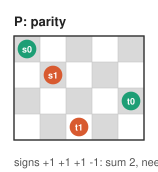 |
| **T1** | all four endpoints on the border, colours alternating A, B, A, B around it (the paths would have to cross) | 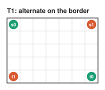 |
| **T2** | the endpoints fill a 2 × 2 square, each colour on a diagonal | 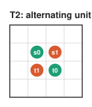 |
| **L1** | an endpoint whose in-grid neighbours are all endpoints of the other colour | 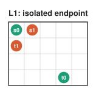 |
| **L6** | a **closed corner** of each colour: an empty corner cell whose two neighbours are endpoints of one colour (and RC > 6) | 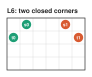 |

### Corner entries

Checked in each of the 8 **corner frames** (4 corners × 2 orientations). Frame coordinates (i, j):
i lines in from the corner along one edge, j along the other. "Empty" means no endpoint.

| | Fires when (frame coordinates) | |
|---|---|---|
| **L2** | (0,1) = a, (1,0) = ā, (0,0) empty: the corner cell would join two colours | 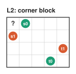 |
| **L3** | (0,2) = a, (1,1) = a, (1,0) = ā; (0,0), (0,1) empty | 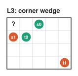 |
| **L4** | (0,0) = a, (1,1) = a, (0,2) = ā; (0,1), (1,0) empty | 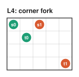 |
| **L5** | (0,0) = a, (0,2) = ā, (2,0) = ā; (0,1), (1,0), (1,1) empty | 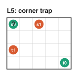 |
| **E1** | along an edge: (0,k) = a, (1,k+1) = a, (1,k+2) = ā, (0,k+3) = ā | 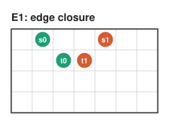 |
| **B** | a listed triple (p, q, r): colour a at p and q, ā at r, and the other ā endpoint on the border **outside** the 6 × 6 corner window | 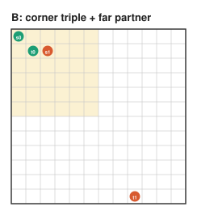 |
| **C** | R, C ≥ 10 and the endpoints, in frame coordinates, are exactly a listed configuration {a-pair, ā-pair} (36 when RC is even) | 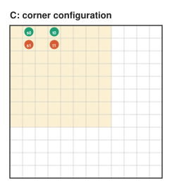 |
| **D** | as C, for RC odd (3 configurations) | |

The lists, cells written as `ij` = (i, j) in the frame:

- **B, RC even** (21): (00 11 12), (01 02 11), (01 02 12), (01 03 11), (01 04 11), (01 04 12),
  (01 05 11), (01 12 11), (01 12 13), (01 12 22), (01 12 31), (01 13 03), (01 21 13), (01 21 22),
  (01 21 31), (02 21 10), (03 11 10), (04 11 10), (04 21 10), (04 21 12), (05 11 10).
- **B, R and C odd** (5): (00 11 12), (00 11 22), (01 02 11), (01 04 11), (04 11 10).
- **C** (36), as {first pair | second pair}: {01 03 | 11 13}, {01 06 | 07 11}, {01 06 | 11 70},
  {01 06 | 12 60}, {01 07 | 11 60}, {01 13 | 11 12}, {01 13 | 12 22}, {01 13 | 12 31},
  {01 22 | 11 12}, {01 22 | 12 31}, {01 22 | 13 30}, {01 70 | 11 60}, {02 11 | 21 30},
  {02 20 | 12 21}, {03 21 | 31 40}, {06 21 | 12 60}, {12 22 | 13 21}, {12 31 | 13 21},
  {01 12 | 04 22}, {01 12 | 04 31}, {01 12 | 13 20}, {01 12 | 13 40}, {01 12 | 20 22},
  {01 12 | 22 40}, {01 12 | 31 40}, {01 13 | 03 04}, {01 13 | 03 20}, {01 13 | 03 40},
  {01 21 | 02 22}, {01 21 | 02 31}, {01 21 | 04 13}, {01 21 | 04 22}, {01 21 | 04 31},
  {01 21 | 13 40}, {01 21 | 22 40}, {01 21 | 31 40}.
- **D** (3): {00 01 | 11 20}, {00 14 | 02 13}, {00 23 | 02 13}.

### R: forced corner routes, then alternation

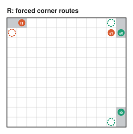

Some corner patterns force a path's route. Visit the 8 frames in a fixed order (row flip, column
flip, transpose as nested bits); in each, apply the first rule that matches, unless it touches
cells already settled:

| Rule | Pattern (frame coordinates) | Settled cells | The endpoint moves |
|---|---|---|---|
| **R3** | (1,2), (2,1) endpoints of different colours; (0,0)–(0,3), (1,0), (1,1), (2,0), (3,0) empty | the 8 cells of the 3 × 3 corner minus (2,2) | (1,2) → (0,3), (2,1) → (3,0) |
| **R2** | (0,0), (1,1) the same colour; (0,1), (1,0), (0,2), (2,0) empty | (0,0), (0,1), (1,0), (1,1) | (0,0) → (0,2), (1,1) → (2,0) |
| **R1** | (0,1) an endpoint; (0,0), (1,0) empty | (0,0), (0,1) | (0,1) → (1,0) |

If any rule applied, walk the border of the grid minus the settled cells (the corners become
staircases). **R** fires if the moved ("effective") endpoints are all on that walk, once each, and
their colours alternate along it: T1 for the remaining region. In the figure, grey cells are
settled and dashed circles are effective endpoints.

The exact evaluation order and edge cases are those of `fires3` in `lean/ZZN/Catalogue.lean`, which
`lib/*/` transcribe; the three implementations agree with it on 60,000 test instances.

## 4. Reductions: delete two free lines

On an axis of length n ≥ 13, delete two free lines d, d+1 when one of these applies. The smaller
instance passes whenever the original does (proved), so it is solved recursively and the solution
is extended back by **band extension** (§5).

| | Applies when | |
|---|---|---|
| **(S) strip** | an edge gap of ≥ 4 lines; delete the 2 outermost | 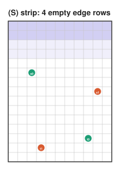 |
| **(K) compression** | an internal gap of ≥ 10 lines; delete 2 from its middle | 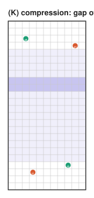 |
| **(I) interior compression** | an internal gap of ≥ 3 lines containing d, d+1 with 8 ≤ d ≤ n − 10 | 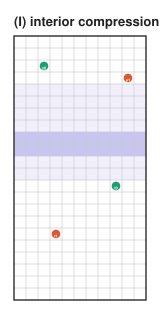 |

The thresholds keep every catalogue entry's view unchanged: the 8 × 8 corner windows, the border
order, parity. A side ≥ 23 always has a reduction, so every irreducible instance has both sides in
[11, 22].

**Same-colour split (Q).** A cut with colour A's pair on one side and B's on the other, where both
pieces pass IPS: solve both pieces as Hamiltonian paths (§6, "2/2 same").

## 5. Extending a solution

**Band extension.** Insert two empty rows directly below a free row r of a solved instance:

1. Every path edge crossing below row r is stretched through the two new rows.
2. The new rows split into blocks between consecutive crossings. Each crossing absorbs the block
   on one side with a **U-detour**: (n1, c) → along row n1 → down → back along row n2 → (n2, c).
3. One block is left over (or none, if some block is empty). It is absorbed by a **square flip**:
   a path edge (r, a)–(r, a+1) inside it is replaced by the block's boundary cycle. Such an edge
   exists by counting: m crossings supply at most m horizontal edges, and m + 1 blocks need m + 1.

| 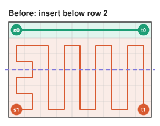 | 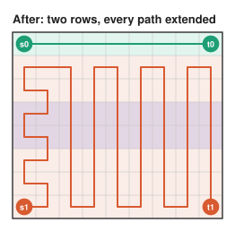 |
|---|---|

**Strip splice.** To append an empty w × L block (wL even, w ≥ 2) along a side of a solved
piece: some path edge runs along the piece's last line (a non-endpoint cell there has degree 2
and only one neighbour off the line). The block has a Hamiltonian cycle containing every edge of
its first line: a row serpentine with a return column when w is even, column snakes when w is odd
(then L is even). Flip the two parallel edges.

## 6. Moves: cut, solve the pieces, glue

When no reduction applies, the instance has sides ≤ 22 and has a **valid move** (verified for
every such instance; §9). A move is a cut plus a choice of crossings. Its pieces must be **OK**:
- a **one-path piece** (one pair, possibly virtual) passes IPS; it is solved by a Hamiltonian-path
  construction;
- a **two-path piece** is either thin and solvable (plug DP), or in 𝔇 and passing the catalogue
  (then solved recursively: it is smaller).

| Move | Endpoints on the near side | Pieces | Glue | |
|---|---|---|---|---|
| **Strip** | all four; the far side is empty, ≥ 2 lines, even area | the near side (two-path) | strip splice | 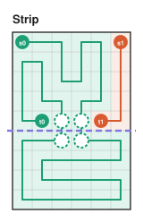 |
| **1/3** | one | the lone endpoint to its crossing (one-path); the rest (two-path) | join at the crossing | 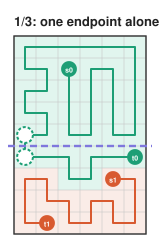 |
| **2/2 cross** | one of each colour | two two-path pieces, two crossings | join at both crossings | 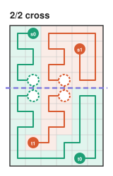 |
| **2/2 same** | one whole pair | two one-path pieces | none | 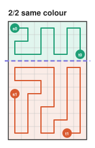 |
| **Excursion** | one whole pair (A) | near: A's two segments as a two-path piece; far: B's pair plus A's excursion | A runs s0 → cut → far → cut → t0 | 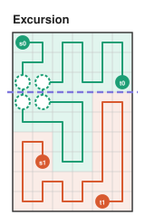 |

**Search order** (as in the proved search `moveB2`): for m = 0, 1, …, 10, try only candidates
whose widest thin piece has width exactly m (m = 0: no thin piece); for each move type, each of the
8 orientations, and only the endpoint relabellings that give different pieces; cut positions in
order; solve the narrower piece first. The first valid candidate is used.

## 7. The algorithm

```
solve(I):                                   # returns (path A, path B) or None
  if min(R, C) <= 10: return plugDP(I)      # PLUGDP.md
  if catalogue fires on I: return None
  if a reduction (S, K or I) deletes lines d, d+1:
      return bandExtend(solve(I minus lines d, d+1), d)
  if a same-colour split exists: return its two Hamiltonian paths
  m := first valid move of I                # exists; sides <= 22
  solve its pieces (Hamiltonian path / plug DP / solve), glue
decide(I) := plugDP feasibility if thin, else "catalogue does not fire"
```

**Cost.** Each reduction removes two lines, so there are O(R + C) of them, each costing a
catalogue check and an O(RC) extension: O((R + C)·RC) overall. The move step runs on boxes of
bounded size (constant time). The plug DP is linear in the long side, with a large constant for
width 10 (about 10⁵ frontier states).

## 8. A worked example

A 16 × 13 instance. It passes the catalogue.

| 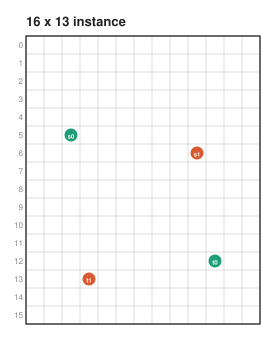 | 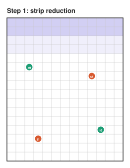 |
|---|---|

1. **Strip reduction.** Rows 0–3 are free and 16 ≥ 13: delete rows 0, 1. The instance becomes
   14 × 13 (all endpoints move up 2).
2. **Strip move.** 14 × 13 has no reduction (edge gaps of 3 and 2 rows). Rows 12–13 are free and
   all endpoints lie above row 12: cut there; the 2 × 13 block below will be spliced in later.
3. **Strip move again.** The 12 × 13 piece: columns 11–12 are free, cut off a 12 × 2 block.
4. **2/2 cross.** The 12 × 11 piece: a horizontal cut between rows 5 and 6 with one crossing of
   each colour. Both halves are thin (6 × 11) and solved by the plug DP.

| 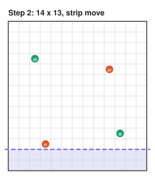 | 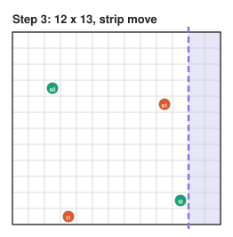 | 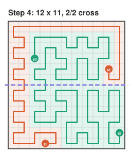 |
|---|---|---|

5. **Glue back.** Splice the 12 × 2 block, then the 2 × 13 block (strip splices).
6. **Extend.** Insert the two deleted rows by band extension (here: below the free border, the
   strip case).

| 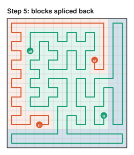 | 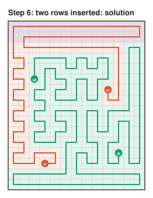 |
|---|---|

Run it: `python3 lib/python/zzn_cli.py 16 13 5 2 12 10 6 9 13 3 --grid --trace`.

## 9. Why it is correct

- **Theorem B** (catalogue sound): if an entry fires on an instance in 𝔇, it is unsolvable. The
  global and local entries by direct arguments; B, C, D by exhaustive *window certificates*.
- **Theorem A** (catalogue complete): every passing instance in 𝔇 is solvable. Induction on area:
  reductions preserve passing and solutions extend back; irreducible instances have sides ≤ 22,
  and a computer check showed each passing one has a valid move.
- **Thin:** the plug DP is exact (sound and complete).

All three are proved in Lean 4 (`lean/README.md`): `passes_iff_solvable`, `thinBF_iff`,
`solvableB_iff`. The finite checks (window certificates, the 144 boxes of sides 11–22) are run by
`native_decide`, which trusts Lean's compiler.

## 10. Where to look

| | |
|---|---|
| Implementations | `lib/python`, `lib/js`, `lib/c` (same algorithm, same output) |
| Plug DP | [PLUGDP.md](PLUGDP.md) |
| Proof in prose | `docs/PROOF.md` |
| Lean | `lean/README.md` |
| Figures | `docs/figures/make_figures.py` regenerates every figure from the Python library |

## License

CC0 1.0 Universal: to the extent possible under law, the author has waived all copyright and
related or neighboring rights to this work. See [`LICENSE`](../LICENSE).
