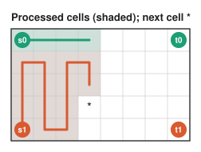

# The plug DP

An exact solver for covering a grid by one or two disjoint paths with given endpoints. It decides
and solves the **thin** case (a side ≤ 10) of the main algorithm ([ALGORITHM.md](ALGORITHM.md)),
the thin pieces of moves, and small Hamiltonian-path pieces. Running time is linear in the long
side; the frontier width is the short side.

Implementations: `lib/python/zzn/plugdp.py`, `lib/js/zzn.js`, `lib/c/zzn.c`. The Lean proof
(`lean/ZZN/Thin/`) verifies a variant with a different state encoding (§6).

## 1. Sweep and frontier

Transpose the grid if needed so that it has W ≤ L rows (W is the short side). Process cells
**column by column, top to bottom**. After some cells are processed, the **frontier** is the
boundary between processed and unprocessed cells: one horizontal edge per row (from the processed
cell into the next column), plus one vertical edge below the current cell.

A **state** records, for each of the W + 1 frontier edges, whether a path uses it and how the
path pieces inside the processed region connect. Slot codes (3 bits each):

| Code | Meaning |
|---|---|
| 0 | edge unused |
| 1, 2 | **anchor** of colour A / B: a piece whose other end is an endpoint (already processed) |
| 3, 4 | **open** / **close** bracket of colour A: a piece with both ends on the frontier |
| 5, 6 | open / close bracket of colour B |

The two ends of a frontier-to-frontier piece are matched like parentheses (pieces cannot cross:
the processed region is simply connected). When the cell in row r is processed, slot r holds the
plug from **above** (the down edge of the cell above) and slot r+1 the plug from the **left**;
afterwards slot r holds the cell's **right** plug and slot r+1 its **down** plug.

## 2. Processing one cell

Let the current cell be in row r. Its **budget** is its degree: 1 if it is an endpoint of colour
c, else 2. It already has `have` incoming plugs (slot r from above, slot r+1 from the left), and
may emit plugs to the right (if not in the last column) and down (if not in the last row). The
outgoing plugs go into slots r (right) and r+1 (down). Let `need = budget − have`; if
`need < 0` or more plugs are needed than directions available, the state dies.

| Incoming | Endpoint cell (budget 1) | Ordinary cell (budget 2) |
|---|---|---|
| none | new anchor of colour c, emitted right or down | new piece: open/close pair of one colour (right + down), for each colour |
| one plug p | p must have colour c. Anchor: piece closed (done). Bracket: its partner becomes an anchor of colour c | p continues right or down |
| two plugs | — (dies) | both of one colour; as (slot r, slot r+1): anchor + anchor: path complete; anchor + bracket: the bracket's partner becomes an anchor; close + open: the two pieces join; open + close: the same piece, a cycle, dies; open + open: the partner of slot r+1 becomes an open bracket; close + close: the partner of slot r becomes a close bracket |

At a column boundary, shift the state by one slot (the down-edge slot leaves, an empty slot
enters at the top). The instance is solvable iff the empty state is reached after the last cell.
A useful filter: the parity rule P (ALGORITHM.md §3) is necessary for any covering by paths, so
check it first (the libraries do, before running the DP).

## 3. Recovering the paths

The forward pass keeps only one **checkpoint** per column: the set of states at the column's
start. Then, for the columns from last to first:
1. re-run the column from its checkpoint, recording each state's predecessor;
2. keep only states whose slots 0…r agree in "used / colour" with the known state at the end of
   the column (slots above r are never changed again within the column);
3. trace back from the known end state; read off each cell's right and down edges; the start state
   (shifted back) is the target for the previous column.

Finally walk each colour's edges from its first endpoint. Memory stays at one column of states with
predecessors plus the checkpoints.

## 4. Variants and costs

- **One path** (Hamiltonian path between s and t): the same DP with only colour A's endpoints
  (`solve_paths(R, C, [(s, 0), (t, 0)])`). The main algorithm uses it for one-path pieces with a
  side ≤ 6.
- **Feasibility only:** the forward pass alone (`solvable_paths`).
- **States:** bounded by the number of valid frontiers of width W + 1: tens at W = 4, about 10⁵
  at W = 10. Time is O(L · W · states); for W = 10 the C version takes about 0.5 s on 11 × 11, and
  grows linearly with L.
- **Splitting long thin grids** (the libraries' optimized solvers, `--optimized`): since the
  state count grows exponentially with the frontier, cut the grid into pieces with a short side
  and run the DP only on those. Each cut is several lines away from every endpoint; the solver
  guesses how the paths cross it (strip, one whole colour per side, one or two single crossings at
  guessed rows) and solves the pieces recursively, along either axis. A piece is called unsolvable
  only after an exact test (parity, IPS, or this DP), and guessing at a piece may cost at most
  about one DP of that piece before the DP decides it, so the answers are exact and the worst case
  is about twice the plain DP. Details: `lib/python/zzn/optimized.py`.

## 5. Correctness, in one paragraph

Every partial solution restricted to the processed cells is a set of disjoint path pieces; its
**signature** (which frontier edges are used, how they pair up, which pieces end at endpoints and
of which colour) is exactly a state. Processing a cell enumerates every way the cell's edges can
extend a signature, and rejects exactly the invalid ones (degree, colour mismatch, cycles). By
induction over cells, the reachable states are exactly the signatures of partial solutions, so the
empty final state is reachable iff a solution exists.

## 6. The Lean version

`lean/ZZN/Thin/` proves this for a DP with a different, proof-friendly encoding: a state is a
sorted list of pieces, each coded by its two **ends** (a column plug, the right plug, or an endpoint
of a colour), plus a bitmask of completed colours. The cells are visited row by row. States with
an end leaving the grid are dropped after each cell. Both directions are proved:
`dpAcceptF_iff : dpAcceptF J = true ↔ Solvable J`, with the standard axioms only.
